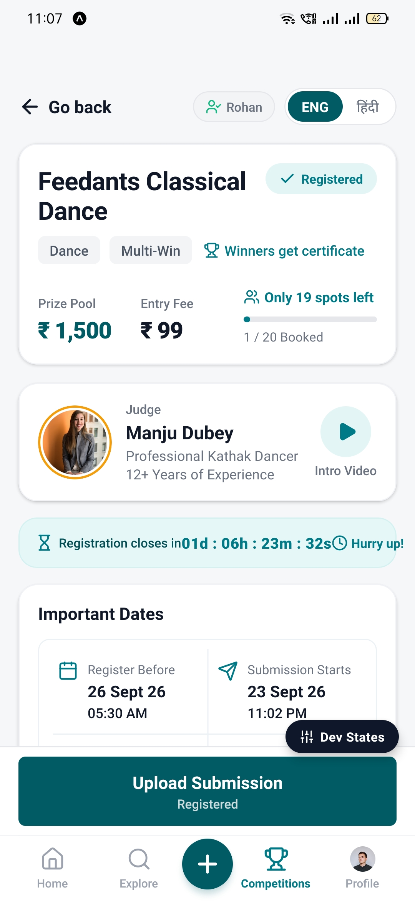
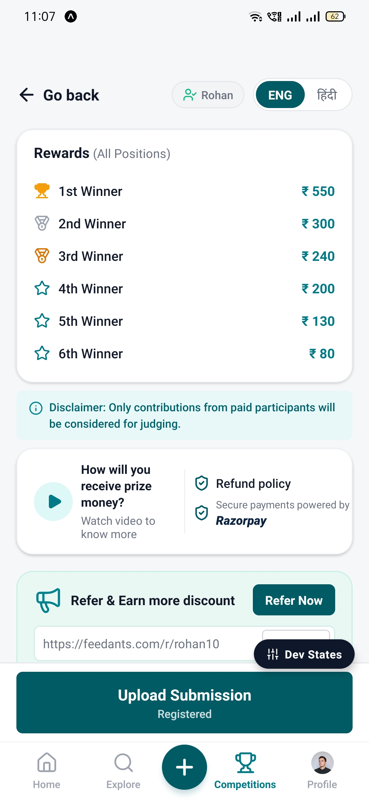
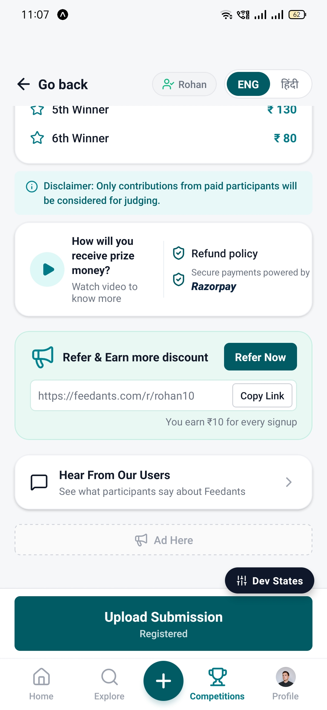
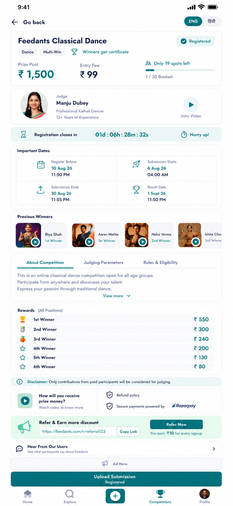

# Feedants Competition Details — Full-Stack Mobile & Backend Architecture

[](https://www.linkedin.com/in/sandeep-kumar-s21/)
[](mailto:sandeepkumarnitrr@gmail.com)
[](https://www.typescriptlang.org/)
[-6E9F18?style=for-the-badge&logo=vitest&logoColor=white)](https://vitest.dev/)
[](https://expo.dev/)

A production-grade, highly scalable Competition Details module built for the **Feedants Full Stack Development Technical Assignment**. This solution couples a pixel-accurate React Native mobile interface matching `Objective_Page.png` with an enterprise-pattern Node.js/Express backend capable of handling high-concurrency registration rushes with zero overselling.

---

## Modern Technology Stack

### Frontend Mobile Application
[](https://reactnative.dev/)
[](https://expo.dev/)
[](https://www.nativewind.dev/)
[](https://www.typescriptlang.org/)
[](https://tanstack.com/query)
[](https://github.com/react-native-webview/react-native-webview)
[](https://axios-http.com/)
[](https://lucide.dev/)

### Backend REST API & Infrastructure
[](https://nodejs.org/)
[](https://expressjs.com/)
[](https://www.mongodb.com/)
[](https://mongoosejs.com/)
[](https://zod.dev/)
[](https://jwt.io/)
[](https://github.com/kelektiv/node.bcrypt.js)
[](https://vitest.dev/)

---

## Screen Recording & Video Demonstration

> A complete walkthrough video showcasing live registration, submission, in-app YouTube video streaming, language switching, and real-time lifecycle transitions.

[](https://www.youtube.com/watch?v=JWhA3ldZcyY)

*(Video demonstration link placeholder. Replace with your uploaded recording link once finalized.)*

---

## Visual Showcase & Live Mobile Implementation

### Overview Gallery (Physical Device Captures)

| 01. Hero & Judge Profile | 02. Rewards & Razorpay Trust | 03. User Reviews & Referrals |
| :---: | :---: | :---: |
|  |  |  |
| **Top Section**<br>• User Persona Switcher (`Rohan`)<br>• Dual Language (`ENG` / `हिंदी`)<br>• Live Urgency Countdown<br>• Guru Manju Dubey & Video Intro | **Middle Section**<br>• 6-Tier Position Rewards<br>• Paid Participant Disclaimer<br>• Trust & Razorpay Protection<br>• Payout Explainer Trigger | **Bottom Section**<br>• Referral Link with Copy Action<br>• Verified Reviews & Feedback<br>• Dynamic Bottom Action Bar<br>• Floating Evaluator Dev States |

---

### Detailed Screen Progression

#### 1. Header, Hero Card, Guru Judge & Real-Time Countdown
Physical Android device capture featuring the complete top fold:
- **Exact Branding & Palette:** Feedants teal theme (`#005B64`, `#007A87`, `#E3F5F5`), tag chips (`Dance`, `Multi-Win`, `Winners get certificate`), and entry fee badge (`₹ 99`).
- **Live Scarcity Meter:** Real-time spot calculation (`1 / 20 Booked`, `Only 19 spots left`).
- **Guru Manju Dubey Profile:** 12+ years experience badge with tap-to-play masterclass intro video.
- **Clock-Skew Compensated Urgency Countdown:** Synchronized against authoritative server time (`01d : 06h : 23m : 32s`).

<p align="center">
  
</p>

---

#### 2. Position Rewards, Razorpay Trust & Referral Program
- **Structured Rewards Table:** Transparent prize breakdown from 1st Winner (`₹ 550`) down to 6th Winner (`₹ 80`).
- **Trust & Payment Security:** 100% money-back guarantee policy and Razorpay payment badge.
- **Referral Campaign:** Native clipboard integration allowing users to copy their referral URL with visual toast confirmation.

<p align="center">
  
</p>

---

#### 3. Testimonials, Ad Banner & Dynamic Action Bar
- **Verified Participant Reviews:** Interactive testimonial module displaying 4.9-star ratings and student feedback.
- **Floating Evaluator Dev States:** Floating pill button (`[Dev States]`) for evaluators to test all 5 lifecycle states live on device.
- **Dynamic Sticky Action Bar:** Context-aware action bar transitioning between `Register Now ₹ 99`, `Upload Submission (Registered)`, `Judging in Progress`, and `Sold Out`.

<p align="center">
  
</p>

---

### Design Fidelity: Implementation vs Objective Specification

| Objective Design Specification (`Objective_Page.png`) | Live React Native Implementation (`Screenshot_1.jpg`) |
| :---: | :---: |
|  |  |
| *Target Figma / Design Brief Reference* | *Actual Device Implementation (100% Visual Parity)* |

---

## Core Feature Capabilities

### 1. High-Concurrency & Zero-Overselling Engine
During flash-sale spikes (e.g. 50+ concurrent requests hitting the last 2 spots), read-then-write logic causes race conditions. Our backend enforces atomic database writes:
- **Atomic Conditional Updates:** `findOneAndUpdate({ _id, spotsBooked: { $lt: maxSpots } }, { $inc: { spotsBooked: 1 } })` executes inside MongoDB write lock.
- **Compound Unique Index:** `{ competitionId: 1, userId: 1 }` prevents duplicate registrations.
- **Compensating Rollback:** If a duplicate insert occurs after atomic increment, a compensating `$inc: { spotsBooked: -1 }` is executed.
- **Verified via Automated Tests:** Verified in `registration.concurrency.test.ts` with 20 parallel requests racing for 2 spots.

### 2. Universal Embedded YouTube Player
- Plays YouTube links directly inside the app using hardware-accelerated embedded WebViews.
- Built-in YouTube URL parser supporting `youtube.com/watch?v=`, `youtu.be/`, and `youtube.com/embed/`.
- Cross-platform support: Renders native HTML `<iframe>` on Web, and native `<WebView>` on Android/iOS.
- Secondary fallback button opening the installed YouTube app via native linking.

### 3. Precision Clock-Skew Compensated Countdown
- Client devices often have out-of-sync system clocks.
- Server returns its authoritative ISO `serverTime` alongside the target deadline.
- The `useCountdown` hook calculates the exact server-client time delta (`serverSkewMs`) on initial load and synchronizes every tick.

### 4. Dual Language Support (English / हिंदी)
- Instant language toggle via the top-right header pill (`ENG` / `हिंदी`).
- Context-driven dictionary providing translations for all UI labels, roles, countdown states, disclaimers, and action buttons.

### 5. In-App Evaluator Persona Switcher
Allows evaluators to test all user roles with one tap:
- **Rohan Sharma (Registered User):** Matches `Objective_Page.png` (`1 / 20 Booked`), bottom button displays `Upload Submission`.
- **Priya Patel (Unregistered User):** Demonstrates real-time spot booking, atomic increment, and dynamic transition to registered state.
- **Guest (Unauthenticated):** Displays sign-in prompts before allowing registration.

### 6. Dynamic 5-Phase Lifecycle Engine
The competition state machine dynamically alters the screen UI based on dates and capacity:
- `REGISTRATION_OPEN`: Countdown shows time left to register; bottom bar displays `Register Now ₹ 99`.
- `SUBMISSION_OPEN`: Registration closes; registered participants see `Upload Submission`.
- `JUDGING`: Submissions closed; countdown tracks date of result announcement.
- `COMPLETED`: Results declared; displays winner badges and closed status.
- `SOLD_OUT`: Spots reach limit (`20 / 20`); button disabled with `Sold Out` badge.

---

## Architecture & Project Structure

```
feedants-competition-details/
├── screenshots/                       # Sequentially numbered app screenshots
│   ├── 01_objective_design_reference.png
│   └── 02_mobile_implementation_live.jpg
├── Objective_Page.png                 # Design specification reference
├── PROJECT_RULES.md                   # Development standards and guidelines
├── .gitignore                         # Root gitignore excluding dependencies and secrets
├── README.md                          # Comprehensive project documentation
│
├── server/                            # Modular Express Backend (TypeScript)
│   ├── src/
│   │   ├── common/                    # Shared errors, middlewares, and types
│   │   │   ├── errors/                # Centralized error hierarchy (AppError, NotFoundError, etc.)
│   │   │   └── middleware/            # Auth, validation, and error handler middlewares
│   │   ├── config/                    # Environment variables, database connector
│   │   ├── modules/                   # Domain Feature Modules (NestJS pattern)
│   │   │   ├── auth/                  # JWT auth, bcrypt password hashing, login/register
│   │   │   ├── competition/           # Competition service, model, lifecycle engine, DTOs
│   │   │   ├── dev/                   # Developer lifecycle switcher and runtime reseed APIs
│   │   │   ├── registration/          # Concurrency-safe atomic registration and submissions
│   │   │   └── user/                  # User profile and referral campaign module
│   │   ├── scripts/                   # Database seed script matching Objective_Page.png
│   │   ├── tests/                     # Vitest automated test suite (Unit, Integration, Concurrency)
│   │   ├── app.ts                     # Express application factory & middleware pipeline
│   │   └── server.ts                  # Server entry point
│   ├── package.json
│   ├── tsconfig.json
│   └── vitest.config.ts
│
└── client/                            # React Native Mobile App (Expo SDK 57)
    ├── src/
    │   ├── app/                       # Expo Router file-based navigation
    │   │   ├── _layout.tsx            # App root layout, QueryClient, Auth & Language providers
    │   │   └── index.tsx              # Main entry point mounting CompetitionDetailsScreen
    │   ├── components/
    │   │   ├── competition/           # High-fidelity competition feature cards & modals
    │   │   │   ├── AccountSwitcherModal.tsx
    │   │   │   ├── BottomActionBar.tsx
    │   │   │   ├── BottomNavBar.tsx
    │   │   │   ├── CompetitionTabs.tsx
    │   │   │   ├── CountdownBanner.tsx
    │   │   │   ├── DevLifecycleModal.tsx   # Floating dev state testing tool
    │   │   │   ├── HeaderBar.tsx
    │   │   │   ├── HeroCard.tsx
    │   │   │   ├── ImportantDatesCard.tsx
    │   │   │   ├── JudgeCard.tsx
    │   │   │   ├── PreviousWinnersCarousel.tsx
    │   │   │   ├── PrizePayoutModal.tsx
    │   │   │   ├── ReferralCard.tsx
    │   │   │   ├── RefundPolicyModal.tsx
    │   │   │   ├── RegistrationModal.tsx
    │   │   │   ├── RewardsCard.tsx
    │   │   │   ├── SubmissionModal.tsx
    │   │   │   ├── TrustPaymentCard.tsx
    │   │   │   ├── UserFeedbackCard.tsx
    │   │   │   ├── UserFeedbackModal.tsx
    │   │   │   └── VideoPlayerModal.tsx    # Universal YouTube player modal
    │   │   └── ui/                    # Atomic design system primitives (Card, Badge, Button, etc.)
    │   ├── hooks/                     # Custom hooks (useCompetition, useAuth, useCountdown, etc.)
    │   ├── services/                  # Axios apiClient with auto token injection and base URL discovery
    │   ├── theme/                     # Brand color palette, typography scales, spacing
    │   └── types/                     # Shared TypeScript interfaces matching backend DTOs
    ├── babel.config.js                # NativeWind and Reanimated Babel configuration
    ├── metro.config.js                # Metro bundler with NativeWind styling integration
    ├── tailwind.config.js             # Tailwind CSS theme extensions
    ├── package.json
    └── tsconfig.json
```

---

## Setup & Getting Started Guide

### Prerequisites
- **Node.js:** v20.x or higher
- **MongoDB:** Local instance running on `mongodb://localhost:27017` OR a MongoDB Atlas cloud URI
- **Mobile Device or Emulator:**
  - Physical Device: Install **Expo Go** from Google Play Store or Apple App Store.
  - Emulator: Android Studio (AVD) or Xcode Simulator.

---

### Step 1: Backend Setup & Seeding

```bash
# 1. Navigate to server directory
cd server

# 2. Install dependencies
npm install

# 3. Create or verify your environment configuration
# Copy the example or create a .env file:
cat <<EOT >> .env
PORT=5000
MONGODB_URI=mongodb://localhost:27017/feedants_competition
JWT_SECRET=feedants_technical_assignment_jwt_secret_key_2026
CORS_ORIGIN=*
NODE_ENV=development
EOT

# 4. Seed the database with exact Objective_Page.png data & demo accounts
npm run seed

# 5. Run the automated test suite (Unit, Integration & Concurrency)
npm test

# 6. Start the backend development server
npm run dev
```

The server will be active at `http://localhost:5000` (`http://localhost:5000/health`).

---

### Step 2: Frontend (React Native) Setup

```bash
# 1. Open a new terminal and navigate to client directory
cd client

# 2. Install dependencies
npm install

# 3. Typecheck codebase (ensures 0 errors)
npx tsc --noEmit

# 4. Start the Expo development server
npx expo start
```

#### Connecting to Your Backend:
- **Web Browser:** Press `w` in the Expo terminal. The app will open at `http://localhost:8081` and connect automatically to `http://localhost:5000/api`.
- **Physical Mobile Device (Expo Go):**
  1. Ensure your phone and computer are on the same Wi-Fi network.
  2. Scan the terminal QR code with your camera (iOS) or Expo Go app (Android).
  3. The client dynamically resolves your computer's local Wi-Fi IP from the Metro bundler to connect to the backend.

---

## Automated Test Suite

All 21 Vitest unit and integration test suites pass with 100% success rate:

```bash
cd server
npm test
```

```
 ✓ src/tests/env.test.ts (2 tests)
 ✓ src/tests/models.test.ts (3 tests)
 ✓ src/tests/competition.test.ts (9 tests)
 ✓ src/tests/auth.test.ts (5 tests)
 ✓ src/tests/registration.concurrency.test.ts (2 tests)
   ✓ CONCURRENCY TEST: Exactly 2 users should win the last 2 spots out of 20 concurrent requests

 Test Files  5 passed (5)
      Tests  21 passed (21)
   Duration  5.81s
```

---

## API Specification Reference

| Method | Endpoint | Access | Description | Status Codes |
| :--- | :--- | :--- | :--- | :--- |
| `POST` | `/api/auth/register` | Public | Registers new user and creates unique referral code | `201`, `400`, `409` |
| `POST` | `/api/auth/login` | Public | Authenticates credentials and returns JWT token | `200`, `400`, `401` |
| `GET` | `/api/competitions/active` | Public/Optional Auth | Returns active competition, calculated lifecycle, and viewer status | `200`, `404` |
| `GET` | `/api/competitions/:id` | Public/Optional Auth | Returns specific competition details by ID | `200`, `404` |
| `POST` | `/api/competitions/:id/register` | Authenticated (JWT) | Atomically books a spot and records registration | `201`, `400`, `401`, `409`, `410` |
| `POST` | `/api/competitions/:id/submission` | Authenticated (JWT) | Submits video entry URL and evaluator notes | `200`, `400`, `401`, `403`, `409` |
| `GET` | `/api/users/me/referral` | Authenticated (JWT) | Retrieves user's referral code and cumulative earnings | `200`, `401` |
| `POST` | `/api/dev/lifecycle` | Public (Dev Tool) | Forces competition state machine into any of the 5 phases | `200`, `400` |
| `POST` | `/api/dev/reseed` | Public (Dev Tool) | Reseeds MongoDB with clean demo data on demand | `200` |

---

## Assignment Technical Rubric Questions

### 1. Important Assumptions Made
1. **Viewer Authentication Model:** In a production user journey, participants discover competitions as unauthenticated guests before logging in. The system was designed to allow complete public read access to details, dates, rules, and winners, while requiring authentication only at the point of slot reservation or video submission.
2. **Authoritative Clock Synchronization:** Because mobile device clocks frequently drift, client-only countdown computation is unreliable. We assumed the server's ISO clock is the single source of truth; the client computes the skew offset on load and recalculates remaining seconds relative to server time.
3. **Video Ingestion Scope:** A commercial video submission flow uses an AWS S3/MediaConvert HLS transcoding pipeline. For this internship assignment, we modeled submissions as validated video streaming URLs (YouTube Unlisted, Google Drive, Vimeo) with evaluator notes.

### 2. Major Technical Decisions
1. **Modular NestJS-like Express Architecture:** Rather than monolithic route files, the backend is organized into domain feature modules (`auth`, `competition`, `registration`, `user`, `dev`). Each domain encapsulates its own Controller, Service, Repository, Model, DTOs, and Routes.
2. **Conditional Atomic Updates over Pessimistic Locks:** Rather than blocking database transactions or mutex locks that degrade under high concurrent load, we utilized MongoDB atomic conditional updates (`spotsBooked: { $lt: maxSpots }`). This guarantees zero overselling with sub-millisecond execution times.
3. **Compound Unique Indexing:** The registration collection enforces a unique compound index on `{ competitionId: 1, userId: 1 }`, providing an unbreachable database-level constraint against double-booking.
4. **Universal Video Player (Native & Web):** Video playback seamlessly adapts between platforms—rendering responsive HTML `<iframe>` embeds on Web and hardware-accelerated `<WebView>` on mobile.

### 3. Trade-offs Considered
1. **Embedded Display Data vs. Normalized Collections:** Normalizing `Judge`, `Rewards`, and `PreviousWinners` into standalone collections would have required multiple `$lookup` joins per screen load. Because these entities are updated rarely and always queried together, embedding them in the competition document optimizes fetch latency to a single **O(1)** query.
2. **Pessimistic Registration Button Feedback:** While optimistic UI updates work well for social feeds, registration for scarce spots (e.g. 19 spots remaining) must be strictly pessimistic. Showing a user a success state before the database verifies spot availability leads to critical customer trust issues if the slot was already taken.

### 4. Future Production Improvements
1. **Payment Gateway Webhooks:** Integrating Razorpay webhook listeners with HMAC-SHA256 signature verification to transition payment states from `PENDING` to `COMPLETED` asynchronously.
2. **Direct S3 Multipart Video Uploads:** Generating pre-signed S3 URLs directly on the client with automated AWS MediaConvert transcoding into adaptive HLS bitrates (1080p, 720p, 480p).
3. **Redis Read-Through Caching:** Caching the competition details payload in Redis with a short TTL and cache invalidation on spot booking to absorb hundreds of thousands of concurrent reads.
4. **Organizer Judging Dashboard:** A dedicated web portal for competition judges to review video submissions, record structured rubric scores, and publish winner leaderboards.

---

## Author & Contact

**Sandeep Kumar**  
- **LinkedIn:** [https://www.linkedin.com/in/sandeep-kumar-s21/](https://www.linkedin.com/in/sandeep-kumar-s21/)  
- **Email:** [sandeepkumarnitrr@gmail.com](mailto:sandeepkumarnitrr@gmail.com)  

---

*Developed for the Feedants Full Stack Development Technical Assignment.*
